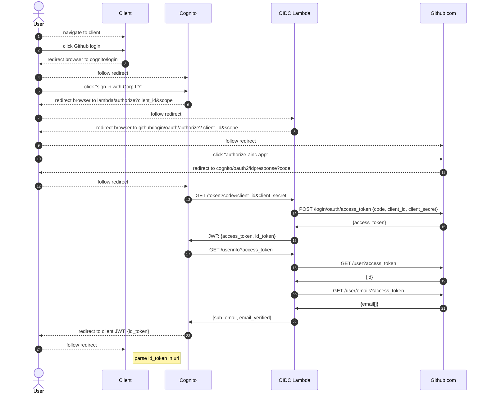

The Github support is a custom shim, based off of: 
https://github.com/TimothyJones/github-cognito-openid-wrapper

The Zinc implementation is cut down from the wrapper though, it's not 
really an "OIDC wrapper" so much as a "do the simplest possible thing I can
to get it going".
* it only supports public github, not enterprise
* id_token is signed with HS256 (symmetric signing based on shared secret) 
  instead of RS256 (asymmetric signing, using JWKS certificate standard)
* supports only the OIDC attributes that Zinc needs, not the full standard set

The Lamba implementation is in 
[LambdaGithubOidcApiV1.ts](/aws-infra/lambda/src/LambdaGithubOidcApiV1.ts).

The AWS CDK setup for Github is in 
[CognitoGithubStackV1.ts](/aws-infra/src/Stack/CognitoGithubStackV1.ts)

### Authentication flow 

* user clicks client "login with github" button
* client redirects browser to zinc-github-au.cognito/login 
  * cognito/login shows "sign in with your corp ID"
* user clicks cognito sign in button
* cognito redirects browser to lambda/authorize (with params)
  * lambda redirects browser to github/login/oath/authorize
* github shows authorization prompt
  * "allow Zinc app to have read only access to email and profile"
* user clicks "authorize"
  * github redirects to cognito/oauth2/idpresponse
  * cognito calls lambda/token
  * lambda calls POST github/login/oauth/access_token
    * github returns access_token
    * lambda returns a respone to cognito that contains both an idtoken and 
      accessToken
  * cognito calls lambda/userinfo
    * lambda calls github/user to get the "id" of the user
    * lambda calls github/user/emails to get email for the user
    * lambda returns a response to cognito that contains the {`sub`, `email`, 
      `email_verified`} claims
  * cognito saves the claims in as a new user in the user pool 
  * cognito redirects browser to client
* client parses id_token out of url params
  * the user is now "authenticated" with Cognito via Github

https://mermaid-js.github.io/mermaid/#/sequenceDiagram
