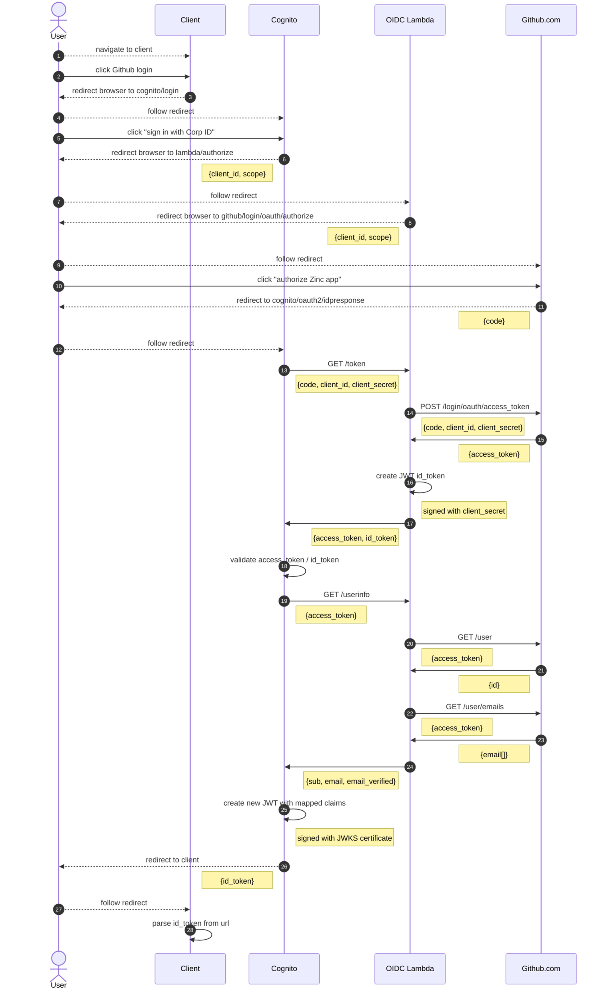

The Github support is a custom shim, based off of:
https://github.com/TimothyJones/github-cognito-openid-wrapper

Note that the Zinc implementation is not meant to be a reusable, generic OIDC
wrapper; it's just the simplest thing that will work for the use-case of
allowing a Github login to the Zinc app.

* it only supports public github, not enterprise
* id_token is signed with the Github `client_secret` configured in Cognito
  instead of a certificate
  * Zinc signature: HS256, symmetric signing based on the shared client_secret
    configured in the Cognito UserPool.
  * openid-wrapper signature: RS256, asymmetric signing using private/public
    keys, validated via the certificates published via JWKS standard.
* supports only the OIDC attributes that Zinc needs, not the full standard set

The Lamba implementation is in
[LambdaGithubOidcApiV1.ts](/aws-infra/lambda/src/LambdaGithubOidcApiV1.ts).

The AWS CDK setup for Github is in
[CognitoGithubStackV1.ts](/aws-infra/src/Stack/CognitoGithubStackV1.ts)

### Authentication flow

### Zinc Authorization

This part has nothing to do with Github or OIDC - I don't want to add it to the
diagram since it's non-standard and the diagram is already too complicated.

After the `id_token` is parsed out by the client, it is sent to the
`zinc/authorize` url to be exchanged for a Zinc `accessToken`. Zinc validates
the JWT `id_token` using the certificate published by Cognito at the JWKS
standard URL.

----

https://mermaid-js.github.io/mermaid/#/sequenceDiagram
