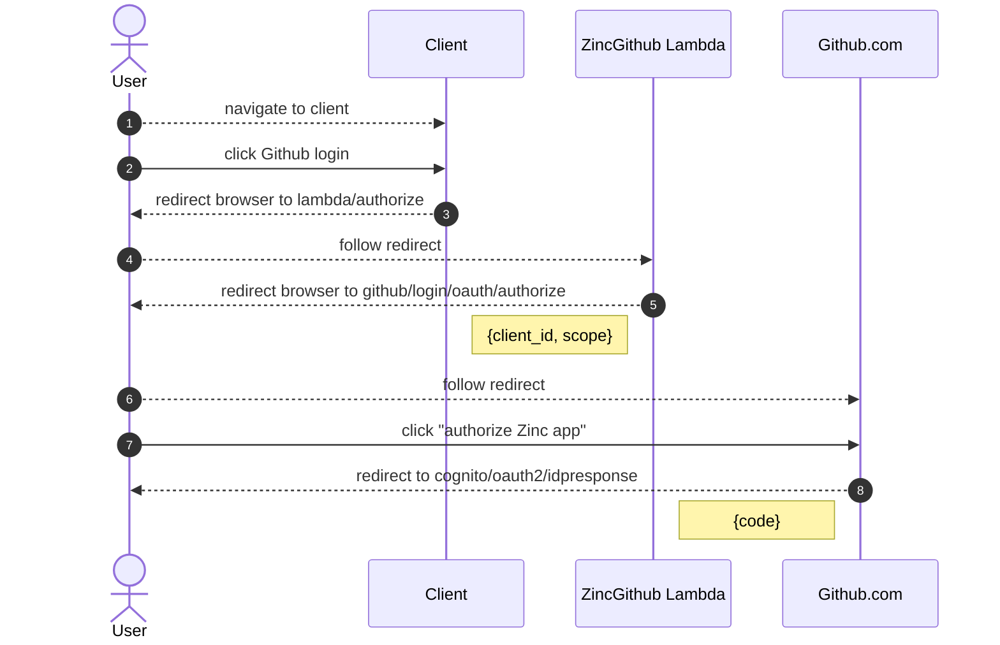

Work in progress.

```mermaid
sequenceDiagram
autonumber
actor user as User
participant client as Client
participant lambda as ZincGithub Lambda
participant github as Github.com

    user-->>client: navigate to client
    user->>client: click Github login
    client-->>user: redirect browser to lambda/authorize
    user-->>lambda: follow redirect
    lambda-->>user: redirect browser to github/login/oauth/authorize
    note left of lambda: {client_id, scope}
    user-->>github: follow redirect
    user->>github: click "authorize Zinc app"
    github-->>user: redirect to cognito/oauth2/idpresponse
    note left of github: {code}

```
