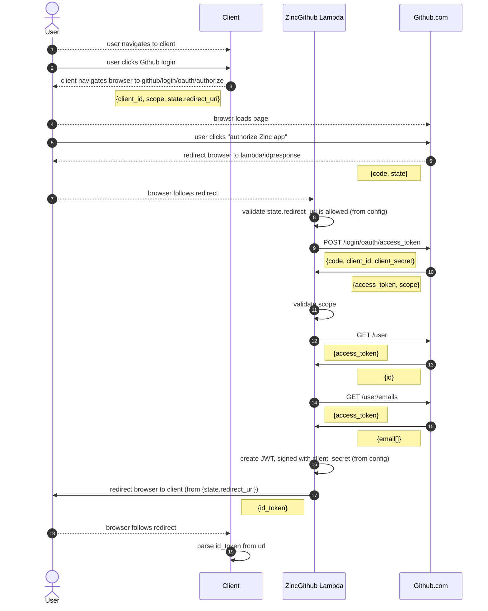

Implemented in [DirectGithubAuthnApiHandler.ts](/aws-infra/lambda/src/AuthnApi/DirectGithubAuthnApiHandler.ts)

```mermaid
sequenceDiagram
autonumber
actor user as User
participant client as Client
participant lambda as ZincGithub Lambda
participant github as Github.com

user-->>client: user navigates to client
user->>client: user clicks Github login
client-->>user: client navigates browser to github/login/oauth/authorize
note left of client: {client_id, scope, state.redirect_uri}
user-->>github: browsr loads page
user->>github: user clicks "authorize Zinc app" 
github-->>user: redirect browser to lambda/idpresponse
note left of github: {code, state}
user-->>lambda: browser follows redirect
lambda->>lambda: validate state.redirect_uri is allowed (from config)
lambda->>github: POST /login/oauth/access_token
note right of lambda: {code, client_id, client_secret}
github->>lambda: 
note left of github: {access_token, scope} 
lambda->>lambda: validate scope
lambda->>github: GET /user
note right of lambda: {access_token}
github->>lambda: 
note left of github: {id}
lambda->>github: GET /user/emails
note right of lambda: {access_token}
github->>lambda: 
note left of github: {email[]}
lambda->>lambda: create JWT, signed with client_secret (from config)
lambda->>user: redirect browser to client (from {state.redirect_uri}) 
note left of lambda: {id_token}
user-->>client: browser follows redirect
client->>client: parse id_token from url

```
