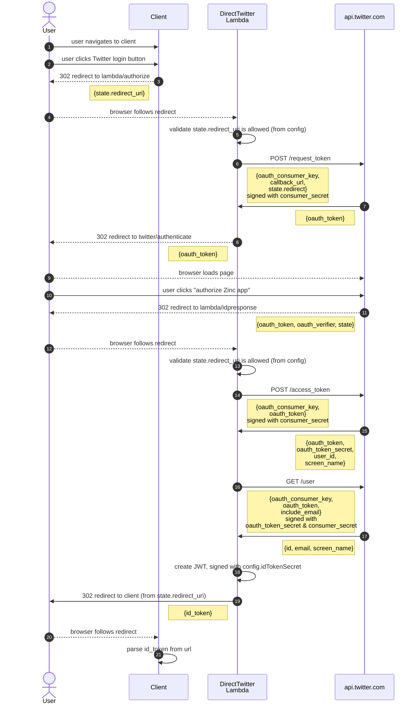

Implemented in [DirectTwitterAuthnApiHandler.ts](/aws-infra/lambda/src/AuthnApi/DirectTwitterAuthnApiHandler.ts)

Based off [expo-twitter-login-example](https://github.com/expo/expo-twitter-login-example)
but with a lot of changes because that code is quite fragile (hand-coded for 
parameter order) and the [createSignature()](https://github.com/expo/expo-twitter-login-example/blob/master/twitter-login-backend/index.js#L143) 
method is flat-out broken for signing user user requests (it uses the 
`encodedRequestURL ` in the `signingKey`, should be the `tokenSecret`).

