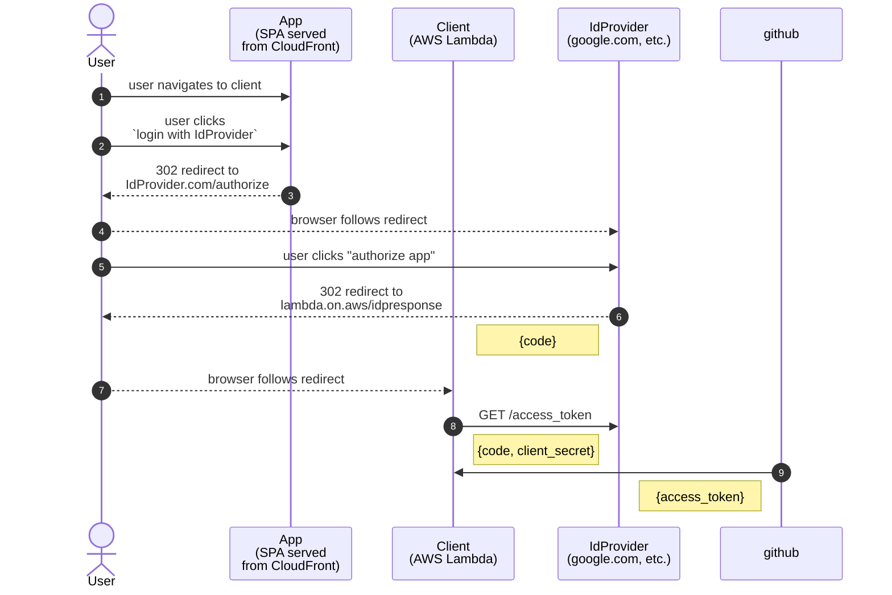

## Terminology - "App" vs "Client"

There are many OAuth2 "grant types": https://oauth.net/2/grant-types/

Often, folks use the word "client" to refer to the Single Page Application 
(the thing that runs inside the browser), or Mobile Application (the thing that
runs on a phone).

But when dealing with OAuth, the word "client" is used in the most generic
way possible, relative to the concept of authorization.
Anything can be a client to the authorization process, even server 
applications/code that have no UI at all, or an actual person using something 
like Postman manually. 

Zinc uses the "authorization code" grant type, which specifies a flow that 
requires a "confidential client". The "confidential client" part means that the
client needs to know a specific `client_secret` that must only be known to the 
client and the IdProvider.  The secret can never be sent to the browser - it's 
the credential your system uses to identify itself to the 
IdProvider[^id-provider-indentification]. 

So, in the context of Zinc's use-case of authenticating users, the "app" is not 
the client, our AWS Lambda is the "client" (the lambda is the thing that knows 
the `client_secret`).  
The Lambda must never send the `client_secret` to the browser, and should be 
very careful with how it's used (i.e. should not even log it).

## OAuth 2.0 "authorization code grant" flow

This is an "idealised" version of the flow, all sorts of important stuff is 
omitted (client ids, scopes, rediret uris, etc.)  
The diagram only shows the flow, and sensitive data. 

At this point, the flow is finished - you have "authorised" the client to 
call the IdProvider on behalf of that specific user, by using the returned
`access_token`.
The access token doesn't tell you anything about the user (email, etc.) 
it's purely a bearer token (usually opaque, not even a JWT) that allows the 
client to call other endpoints to access data about the user.

After the code grant flow is done, the client can use the access token to call 
standard OIDC endpoints to gather info about the user.  

[cognito-github.md](/aws-infra/lambda/doc/cognito-github.md) shows how Zinc
integrates Github into Cognito as an OIDC IdProvider by implementing the 
authorization code grant flow and then calling the non-stanard Github 
`/userinfo` endpoint and mapping the results back to a stanard OIDC 
`id_token` JWT bearer token.

Twitter authn works similarly but requires a bunch of fiddly OAuth1.0a
guff before we can call their `/user` endpoint to get the info we need to 
create an `id_token`, see 
[direct-twitter-sign-in.md](/aws-infra/lambda/doc/direct-twitter-sign-in.md).

----

[^id-provider-indentification]:
IdProviders require authorization of the client because they want can be sure
the caller is someone they trust to do authentication on behalf of their users.  
Identifying the client system securely is also important so that the IdProvider
can provide a nice prompt to the user about who they're authorizing to use
their account, and for abuse detection (rate-limiting, etc.)

Then there's the financial aspect. If you're using an IdProvider's auth system
to make money - eventually, when there's enough money on the table (and you're
solidly locked in), they'll want a slice of the pie.
