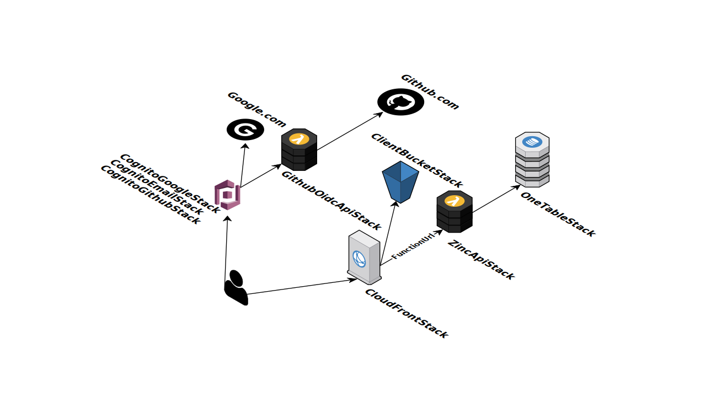

The Zinc repo is for my learning about Cognito and aws-cdk.
Begun as a Proof-of-Concept ("PoC") of Cognito functionality for 
kopi.cloud.

## Functionality

[Try it out](https://d3q1l9etnq2dqk.cloudfront.net) - hosted on my own AWS
account.  If that's not working, have a look in `/client/package.json/proxy`-
I may have forgotten to update this doco.

Or I might just not be running the project live any more.  See instructions for
[running your own infrastructure](doc/running-own-infra.md).

If the code is not working on your machine, please let me know in the Github
discussions.

It doesn't do much of anything:
* Login via email, Google or Github.
  * there are two implementations of Social Sign-in - one through Cognito and
  the other directly to the ID Providers.
  * the Github-Cognito integration requires an entire 
    [cognito-github OIDC shim](aws-infra/lambda/doc/cognito-github.md)
  * the direct sign-in is significantly simpler, see
  [direct-github-sign-in.md](aws-infra/lambda/doc/direct-github-sign-in.md)
* Set your own "display name" .
* List all users that have signed up 
  * only lists created date and user-entered "display name", 
  not email or any SSO profile data.

## Project structure

Typescript codebase structured as a monorepo, using NPM to build and deploy.

There's no CI/CD infrastructure, though I may stand up a CDK pipeline one day.

* [aws-infra/](aws-infra)
  * `aws-cdk` project for building the infrastructure
  * [lambda /](aws-infra/lambda)
    * contains all code for the APIs served by Lambda
    * no framework (Serverless, SAM, etc.)
* [client/](client)
  * React based SPA, using Material UI for components 
* [doc/](doc)
  * documentation topics to link to from readme files / source code  
* [shared/](shared)
  * placeholder for when I figure out how to actually do this with a 
    create-react-app codebase
  * the actual shared code sits under the `client` project at  
  [/client/src/Shared](/client/src/Shared), see the [readme](/shared/readme.md) 
  for more detail.  

## AWS infrastructure

Diagram by [Cloudcraft](https://www.cloudcraft.co/).
See [aws-infra/readme](aws-infra/readme.md) for more details.
See [running your own infrastructure](doc/running-own-infra.md) for 
instructions on bootstrapping and configuring the whole project in your own 
AWS account.

## AWS cost

During development, monthly costs were  2 cents per month (because of many
read and write calls to S3 during the many deployments) - every thing else
fits easily within the [Always free](https://aws.amazon.com/free) tier.

I haven't done any estimation analysis but I would not be surprised to find the
Zinc app (as-is) could support many hundres of users within the free tier.
Though you would need to bump the max concurrency of the lambdas.

This would change quickly with a real app though.  Lambda and DynamoDB can get
expensive to run when you use them a lot under constant load.  They only
become a sensible choice again for high-scale requirements.

My personal choice of cloud architecture for medium scale apps would be a
container-based backend running on an ASG -> ELB -> EC2 setup backed by an
RDS database. Swap out the EC2 stuff for an AppRunner setup when it becomes
viable.
The API and security model is designed for a state-free backend approach, so
the above setup is fairly easy to implement and support.
There'd probably still be a few Lambdas being used for low-volume
integration/glue purposes (which is their sweet-spot, in my opinion).

## Local development 
* edit the `proxy` setting in [client/package.json](./client/package.json) and
set it to the cloudfront url you've created.
  * if you leave it alone, you will be pointing at my AWS account
* run `client` / `npm start-dev` to start the client locally, the `proxy` setting 
will proxy calls out to the lambda running under cloudfront
  * uses create-react-app hot deploy, so turnaround for code changes is quick 
* run `aws-infra` / `npm run hotswap-cloudfront` to do a fast deployment of 
changed lambda code
  * turn around for changes is about 10-15 seconds - not great but good enough
  for a demo codebase
  * could also use the CDK - SAM integration for local development, but I 
  haven't dug into it

## Security considerations

There are a lot of shortcuts taken in the Zinc codebase.

* the accessToken is stored in local-storage, not as a secure http cookie - 
  so there's no implementaiton of CSRF prevention
  * I'm personally fine with this, but some people think it's "not the way"
  * if you decide to use a cookie, you'll need to implement a CSRF prevention
  strategy
* the direct login implementation leaks the unique-ID that providers use to
identify a user - e.g. if you login and go to the user list, you can find out
my Github and Google unique id
  * I don't know what the threat model is for this, seems innocuous to me, but
    it's worth pointing out
* the backend authentication and authorization code needs lots more 
  logic (and testing) of checking and verifying claims, scopes, etc.
* secrets stored in plain SSM params
  * this is done for cost, AWS App Config and Secrets Manager cost money I 
  don't want to pay for a demo code base.  
  * If you're adapting any of this code for real, you should not store 
  secrets in SSM.

Please feel free to create Github issues, pull requests or discussion topics 
regarding these or other security considerations you'd like to talk about.
